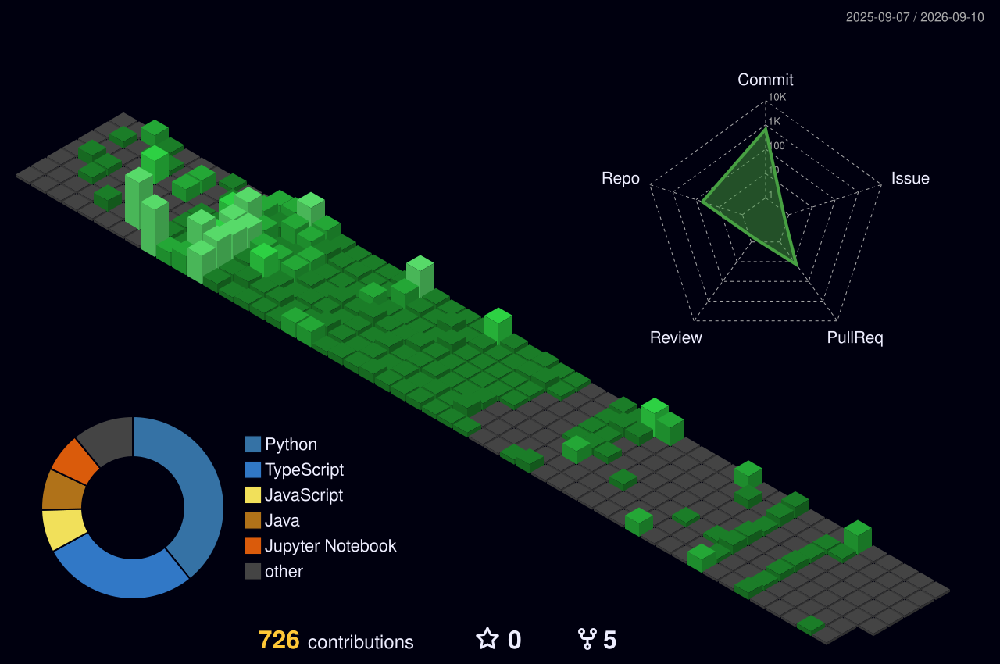

## Hello, I'm Mohammed Fazil Momin

Welcome to my GitHub profile! I'm a passionate software developer who loves tackling complex challenges, building innovative solutions, and contributing to the open-source community. Explore my repositories below to see my latest projects and contributions.

---

## 💻 Tech Stack

### 🚀 Programming Languages

### 🎨 Frontend Development

### ⚙️ Backend Development

### 🗄️ Databases & Storage

---

## 🤝 Connect with Me

  
  
  

---

## 🎨 3D Contribution Graph

---

